# Diagrama de Rede — results.com.br

> Gerado em 2026-08-06. Atualizado em 2026-08-07 (adicionado roteador Claro e
> interface eth2 do srvfw0).

## Topologia de borda (WAN → LAN)

```
Internet ─── Roteador Claro ─── srvfw0 ─── 10.10.2.30 (mexico)
             201.6.110.53       10.10.2.254   Docker
             DMZ → 192.168.0.2   eth2: 192.168.0.2
                                 eth1: 192.168.15.3
                                 eth0: 10.10.2.254
```

O IP público `201.6.110.53` pertence ao **roteador da Claro** (modem ISP).
O DMZ do roteador encaminha TODO o tráfego de entrada para `192.168.0.2`
(interface `eth2` do srvfw0). O srvfw0 aplica DNAT por porta para as VIPs
em `10.10.2.30`.

```mermaid
graph TB
    subgraph EXTERNO["🌐 Internet"]
        CLIENT["Clientes externos<br/>MX records → mx1/mx2<br/>A records → results.com.br"]
    end

    subgraph CLARO["📡 Roteador Claro (Modem ISP)"]
        WAN["WAN — 201.6.110.53<br/>(IP público)"]
        DMZ["DMZ → 192.168.0.2<br/>(todo tráfego de entrada)"]
    end

    subgraph FW["🛡️ srvfw0 / gabao<br/>Xen VM — 3 interfaces"]
        direction TB
        ETH2["eth2: 192.168.0.2/24<br/>← recebe DMZ do Claro"]
        ETH1["eth1: 192.168.15.3/24<br/>← rede interna paralela"]
        ETH0_FW["eth0: 10.10.2.254/24<br/>← rede principal"]
        PREROUTING["PREROUTING DNAT"]
        ETH2 --> PREROUTING
        PREROUTING ---|"UDP/TCP :53 → 10.10.2.1"| DNS_IN
        PREROUTING ---|"TCP :25,465,587 → 10.10.2.3"| SMTP_IN
        PREROUTING ---|"TCP :110,143,993,995 → 10.10.2.3"| IMAP_IN
        PREROUTING ---|"TCP :80,443 → 10.10.2.60"| WEB_IN
        PREROUTING ---|"TCP :5555 → 10.10.2.30"| VPN_IN
    end

    subgraph HOST["🖥️ mexico — 10.10.2.30<br/>Alpine Linux + Docker 27.3.1"]

        subgraph ETH0["eth0 — IPs vinculados"]
            IP30["10.10.2.30/24  ← principal + VPN"]
            IP1["10.10.2.1/32   ← VIP ns1"]
            IP3["10.10.2.3/32   ← VIP mx1 / IMAP"]
            IP20["10.10.2.20/32  ← VIP ns2"]
            IP23["10.10.2.23/32  ← VIP mx2"]
            IP60["10.10.2.60/32  ← VIP web"]
            IP49["10.10.2.49/32  ← VIP mysql"]
            IP79["10.10.2.79/32  ← VIP mysql"]
            IP89["10.10.2.89/32  ← VIP mysql"]
            IP99["10.10.2.99/32  ← VIP mysql"]
        end

        subgraph DOCKER["🐋 Docker Engine"]

            subgraph NET["infra-shared — bridge<br/>192.168.48.0/20"]
                DNS_DOCKER["127.0.0.11<br/>DNS interno Docker"]
            end

            subgraph STACK_WEB["Stack Web — docker-compose.yml"]
                APACHE["secure-httpd<br/>Apache 2.4-alpine<br/>bind: 10.10.2.60:443"]
                JOOMLA["results-joomla<br/>PHP 7.4 + Roundcube<br/>aliases: joomla"]
                SUBDOMAIN["httpd-subdomain-sync<br/>vhosts via MySQL"]
                LSYNCD_AP["httpd-lsyncd<br/>sync Apache configs"]
                LSYNCD_JO["joomla-lsyncd<br/>sync Joomla site"]
            end

            subgraph STACK_MAIL["Stack Mail — docker-compose.mail.yml"]
                MX1["results-mail-postfix<br/>Postfix MX1<br/>bind: 10.10.2.3:25,465,587"]
                MX2["results-mail-postfix-mx2<br/>Postfix MX2<br/>bind: 10.10.2.23:25"]
                DOVECOT["results-mail-dovecot<br/>Dovecot IMAP/POP3/Sieve<br/>bind: 10.10.2.3:143,993,4190"]
                RSPAMD["results-mail-rspamd<br/>Anti-spam + Redis"]
                CLAMAV["results-mail-clamav<br/>Antivirus"]
                LDAP["results-ldap<br/>OpenLDAP<br/>bind: ldap://:389"]
                CERTBOT["results-mail-certbot<br/>TLS certificates"]
            end

            subgraph STACK_DNS["Stack DNS — dns-consolidated/"]
                DNSDIST["dns-dnsdist<br/>bind: 10.10.2.1:53, 10.10.2.20:53"]
                PDNS_AUTH["pdns-auth<br/>10.53.53.11:53"]
                PDNS_REC["pdns-recursor<br/>10.53.53.12:53"]
            end

            subgraph STACK_EDGE["Stack Edge SNI"]
                HAPROXY["edge-sni<br/>HAProxy SNI<br/>bind: 10.10.2.60:443"]
            end

            subgraph STACK_VPN["Stack VPN"]
                VPN["rvpn<br/>SoftEther<br/>bind: 10.10.2.30:5555"]
            end

            subgraph STACK_DB["Stack MySQL — host network"]
                MYSQL0["srvmysql0<br/>MariaDB Galera<br/>bind: 10.10.2.79"]
                MYSQL1["srvmysql1<br/>MariaDB Galera<br/>bind: 10.10.2.89"]
                MYSQL2["srvmysql2<br/>MariaDB Galera<br/>bind: 10.10.2.49"]
                PROXYSQL["mysql-proxysql<br/>ProxySQL<br/>bind: 10.10.2.99:3306,6033,6034"]
            end
        end
    end

    WAN -->|"NAT"| FW
    FW -->|"DNAT → VIPs"| ETH0

    APACHE -.->|"bind"| IP60
    MX1 -.->|"bind"| IP3
    MX2 -.->|"bind"| IP23
    DOVECOT -.->|"bind"| IP3
    DNSDIST -.->|"bind"| IP1
    DNSDIST -.->|"bind"| IP20
    VPN -.->|"bind"| IP30

    JOOMLA -->|"IMAPS:993"| DOVECOT
    JOOMLA -->|"SMTP:587"| MX1
    JOOMLA -->|"Sieve:4190"| DOVECOT
    JOOMLA -->|"MySQL:3306"| PROXYSQL
    SUBDOMAIN -->|"MySQL:3306"| PROXYSQL

    APACHE -->|"proxy"| JOOMLA
    HAPROXY -->|"SNI route"| APACHE

    DNSDIST -->|"auth pool"| PDNS_AUTH
    DNSDIST -->|"recurse pool"| PDNS_REC

    MX1 -->|"antispam"| RSPAMD
    MX1 -->|"antivirus"| CLAMAV
    MX1 -->|"auth LDAP"| LDAP
    DOVECOT -->|"auth LDAP"| LDAP
    DOVECOT -->|"antispam sieve"| RSPAMD

    MYSQL0 <-->|"Galera replication"| MYSQL1
    MYSQL1 <-->|"Galera replication"| MYSQL2
    PROXYSQL -->|"r/w:6033 r/o:6034"| MYSQL0
    PROXYSQL -->|"r/w:6033 r/o:6034"| MYSQL1

    APACHE -.- NET
    JOOMLA -.- NET
    SUBDOMAIN -.- NET
    LSYNCD_AP -.- NET
    LSYNCD_JO -.- NET
    MX1 -.- NET
    MX2 -.- NET
    DOVECOT -.- NET
    RSPAMD -.- NET
    CLAMAV -.- NET
    LDAP -.- NET
    CERTBOT -.- NET
    DNSDIST -.- NET
    PDNS_AUTH -.- NET
    PDNS_REC -.- NET
    HAPROXY -.- NET

    style HOST fill:#1a1a2e,stroke:#16213e,color:#eee
    style DOCKER fill:#0f3460,stroke:#16213e,color:#eee
    style NET fill:#1a3a5c,stroke:#2a5a8c,color:#bcd
    style STACK_WEB fill:#162447,stroke:#1f4068,color:#ddd
    style STACK_MAIL fill:#162447,stroke:#1f4068,color:#ddd
    style STACK_DNS fill:#162447,stroke:#1f4068,color:#ddd
    style STACK_EDGE fill:#162447,stroke:#1f4068,color:#ddd
    style STACK_VPN fill:#162447,stroke:#1f4068,color:#ddd
    style STACK_DB fill:#162447,stroke:#1f4068,color:#ddd
    style FW fill:#533a1a,stroke:#6b4c1e,color:#ddd
    style EXTERNO fill:#1a2e1a,stroke:#2e4e1e,color:#ddd
```



## Regras fundamentais

| Regra | Detalhe |
|---|---|
| **Nenhum container usa `10.10.2.30`** | Cada serviço tem sua VIP. `10.10.2.30` é só o host + VPN |
| **Comunicação entre containers** | Sempre via DNS interno (`127.0.0.11`), usando `container_name` |
| **Rede única `infra-shared`** | Todos os stacks Web, Mail, DNS e Edge SNI compartilham a mesma bridge |
| **Galera em `network_mode: host`** | MariaDB Galera usa a rede do host diretamente (precisa das VIPs .49/.79/.89) |
| **Firewall faz DNAT** | `srvfw0` (10.10.2.254) redireciona tráfego externo para as VIPs |
| **dnsdist faz split-horizon** | Clientes internos (10.0.0.0/8, etc.) → recursor. Externos → auth |

## Tabela de VIPs

| VIP | Serviço | Container(es) |
|---|---|---|
| `10.10.2.1` | DNS ns1 | `dns-dnsdist` |
| `10.10.2.3` | MX1 / IMAP / SMTP | `results-mail-postfix`, `results-mail-dovecot` |
| `10.10.2.20` | DNS ns2 | `dns-dnsdist` |
| `10.10.2.23` | MX2 SMTP | `results-mail-postfix-mx2` |
| `10.10.2.30` | Principal / VPN | `rvpn` (SoftEther) |
| `10.10.2.49` | MariaDB | `srvmysql2` |
| `10.10.2.60` | Web HTTP/HTTPS | `secure-httpd`, `edge-sni` |
| `10.10.2.79` | MariaDB | `srvmysql0` |
| `10.10.2.89` | MariaDB | `srvmysql1` |
| `10.10.2.99` | ProxySQL | `mysql-proxysql` |

## Stacks e Compose files

| Stack | Arquivo | Rede |
|---|---|---|
| Web | `docker-compose.yml` | `infra-shared` |
| Mail | `docker-compose.mail.yml` | `infra-shared` |
| DNS | `dns-consolidated/docker-compose.yml` | `infra-shared` |
| Edge SNI | `docker-compose.edge-sni.yml` | `infra-shared` |
| VPN | `docker-compose.vpn.yml` | bridge própria |
| MySQL Galera | `docker-compose.mysql-galera.yml` | `host` |
| ProxySQL | `docker-compose.proxysql.yml` | `host` |
